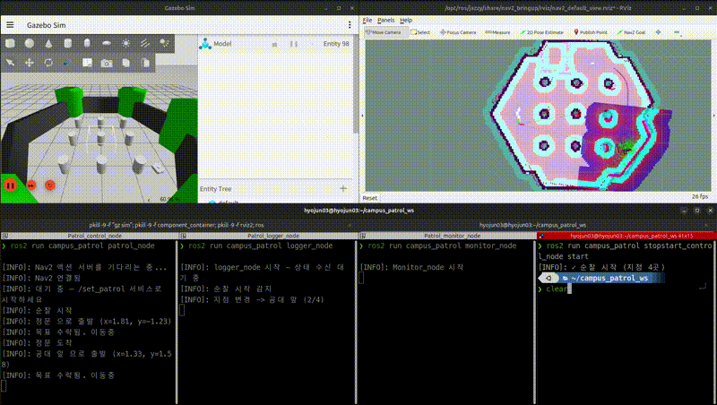
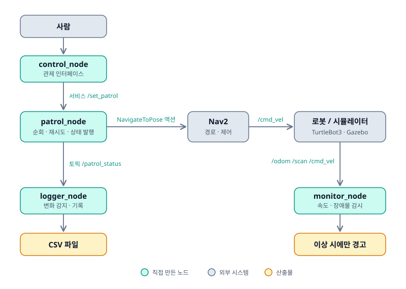
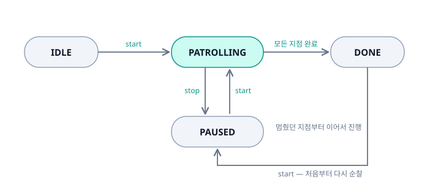

# campus_patrol

Nav2 위에 순찰 임무를 수행·감시·기록하는 계층을 올린 ROS 2 프로젝트.

캠퍼스 순찰 시나리오를 실내 시뮬레이션 환경으로 축소해, 웨이포인트 자동 순회와 실패 처리, 상태 보고, 주행 기록을 구현했습니다.

<!-- 여기에 GIF: 재시도 장면 20초 -->


---

## 만든 것

Nav2는 "A 지점으로 가라"까지만 해줍니다. **여러 지점을 순서대로 돌고, 실패하면 판단하고, 지금 뭘 하는지 밖에 알리는 것**은 아무도 안 해줍니다. 그 계층을 직접 만들었습니다.

| 노드 | 역할 |
| --- | --- |
| `patrol_node` | 웨이포인트 순회, 도달 실패 시 재시도·건너뛰기, 상태 발행 |
| `logger_node` | 순찰 기록을 CSV로 저장, 종료 시 요약 출력 |
| `monitor_node` | 명령 속도 대비 실제 속도, 장애물 근접 감시 |
| `stopstart_control_node` | 순찰 시작/중지 관제 인터페이스 |

---

## 시스템 구조



**통신 방식은 성격에 따라 나눴습니다.**

- **토픽** `/patrol_status` — 상태는 계속 흘러야 하고 답장이 필요 없습니다. 여러 노드가 동시에 구독할 수 있어야 합니다.
- **서비스** `/set_patrol` — 시작이 실패할 수 있습니다(이미 순찰 중, Nav2 미준비). 성공 여부를 확인해야 하므로 응답이 오는 방식이어야 합니다.
- **액션** `NavigateToPose` — 주행은 수십 초가 걸리고, 진행 상황을 알아야 하며, 중간에 취소할 수 있어야 합니다. 토픽은 결과를 모르고, 서비스는 그동안 노드가 멈춰 있어야 하므로 둘 다 맞지 않습니다.

---

## 실행

**환경**: Ubuntu 24.04 · ROS 2 Jazzy · Gazebo Harmonic · TurtleBot3 · Nav2

```bash
# 1) 시뮬레이션 + Nav2
ros2 launch nav2_bringup tb3_simulation_launch.py headless:=False
# RViz 에서 2D Pose Estimate 로 초기 위치 지정

# 2) 순찰 시스템 (노드 3개)
ros2 launch campus_patrol patrol.launch.py

# 3) 순찰 시작 / 중지
ros2 run campus_patrol stopstart_control_node start
ros2 run campus_patrol stopstart_control_node stop
```

### 빌드

```bash
cd ~/campus_patrol_ws
colcon build
source install/setup.bash
```

---

## 동작

### 순찰 흐름



중지 후 재개하면 **멈췄던 지점부터 이어서** 진행합니다.

### 실패 처리

각 지점마다 도달을 시도하고, 실패하면 최대 3회 재시도한 뒤 건너뜁니다.

- **타임아웃 감시** — Nav2가 결과를 주지 않는 경우가 있어, 상위 노드가 60초를 재고 강제 취소합니다.
- **재시도 지연** — 취소 요청 직후 새 목표를 보내면 Nav2가 거부하므로, 2초 뒤에 재시도합니다.

### 출력 예시

```
[patrol_node] 순찰 시작
[patrol_node] 정문 으로 출발 (x=1.81, y=-1.23)
[patrol_node] 정문 도착
[logger_node] 지점 변경 -> 공대 앞 (2/4)
[patrol_node] 생명대 앞 시간 초과 (설정 60.0초 / 실제 60.0초)
[patrol_node] 생명대 앞 재시도 1/3 - 시간 초과
[monitor_node] 속도 추종 불량: 명령 0.26 / 실제 0.02 m/s (3초 지속)
[monitor_node] 속도 추종 정상 회복 (8초 만에)
[logger_node] 순찰 완료
[logger_node] 로그 파일 저장 완료: ~/campus_patrol_logs/patrol_20260807_201407.csv
```

### 기록 결과

```csv
시각,순번,지점,소요시간,재시도
20:14:07,0,정문,12.3,0
20:14:25,1,공대 앞,18.1,0
20:15:02,2,생명대 앞,37.4,2
20:15:19,3,예술대 앞,17.2,0
```

---

## 설계에서 신경 쓴 것

**감시는 조용할 때가 정상입니다.** `monitor_node`는 상태를 계속 받지만 로그는 이상할 때만 찍습니다. 정상 값을 매초 출력하면 정작 중요한 경고가 묻히기 때문입니다. 순간적인 값 튐을 거르기 위해 "임계 초과가 3초 이상 지속될 때만" 경고하고, 같은 경고가 반복되지 않도록 한 번 알린 뒤에는 정상 복귀 전까지 침묵합니다.

**노드를 관심사로 나눴습니다.** 웨이포인트 1번과 2번은 같은 상태를 공유하므로 한 노드 안에서 관리하고, 순찰 진행·기록·하드웨어 감시는 서로 다른 것을 보고 있으므로 분리했습니다. `logger_node`를 껐다 켜도 순찰에는 영향이 없습니다.

**대기 시간은 타이머로 처리했습니다.** `time.sleep`을 쓰면 노드 전체가 멈춰서 그동안 중지 명령도 받지 못합니다. 재시도 지연과 타임아웃 감시 모두 타이머로 예약하고 즉시 반환하는 방식으로 구현했습니다.

---

## 시행착오

<details>
<summary>펼쳐보기</summary>

### 좌표 한 글자가 만든 전면적 실패

```python
goal.pose.pose.position.x = waypoint['x']
goal.pose.pose.position.x = waypoint['y']   # y 여야 할 자리
```

y 좌표가 x에 덮어씌워져 모든 웨이포인트가 `y=0` 직선 위로 전송됐습니다. 로봇이 엉뚱한 곳으로 가고 경로 실패(`status=6`)가 반복됐는데, 증상만 보고는 좌표 설정 문제인지 Nav2 문제인지 구분되지 않았습니다. 로그에 실제 전송 좌표를 찍고 나서야 원인이 드러났습니다.

**증상이 나타난 곳과 원인이 있는 곳은 다르다** — 이 프로젝트에서 가장 많이 겪은 패턴입니다.

### 비동기 취소의 함정

타임아웃으로 목표를 취소하고 곧바로 재시도 목표를 보냈더니, 재시도가 즉시 `status=6`으로 실패했습니다.

`cancel_goal_async()`는 **요청만 보내고 바로 반환**합니다. 취소가 완료되기 전에 새 목표가 도착하면 Nav2가 이를 거부하거나 즉시 중단시킵니다. 재시도 전에 2초 지연을 두어 해결했습니다.

동시에, 취소된 목표의 결과가 **새 목표를 보낸 뒤에 뒤늦게 도착하는** 문제도 있었습니다. `on_result` 콜백은 어느 목표의 결과인지 구분하지 못하기 때문에, 옛 결과가 새 목표의 결과로 오인되어 순찰 순서가 꼬였습니다. `cancelling` 플래그로 "내가 취소한 것"을 표시해 걸러냈습니다.

**액션은 요청 순서와 응답 순서가 보장되지 않습니다.** 어느 요청에 대한 응답인지 상위 계층이 직접 추적해야 합니다.

### 정리하지 않으면 다음 명령이 막힌다

노드를 강제 종료한 뒤 RViz에서 목표를 찍으면 `Goal was rejected by server`가 떴습니다. 이전 목표가 정리되지 않아 Nav2가 새 목표를 받지 못하는 상태였습니다. 중지 시 진행 중인 목표와 타이머를 모두 취소하도록 정리 로직을 추가했습니다.

### 배포판 패키지 간 ABI 불일치

`diagnostic_updater`를 설치한 뒤 Nav2 컨테이너가 심볼 오류로 죽었습니다.

```
undefined symbol: _ZN18diagnostic_updater7UpdaterC1E...
```

Gazebo가 안 뜨는 것처럼 보였지만, 실제로는 Nav2 라이프사이클 매니저가 로드 단계에서 실패한 것이었습니다. 로그를 끝까지 읽지 않았다면 하드웨어 성능이나 시뮬레이터를 의심하며 시간을 더 썼을 것입니다.

### Gazebo Classic EOL 이후의 생태계

프로젝트 초기에 여러 오픈소스 월드를 시도했으나 대부분 실패했습니다.

| 시도 | 실패 원인 |
| --- | --- |
| AWS RoboMaker Bookstore | `gazebo_ros` 의존 — Classic 전용 패키지 |
| Gazebo Fuel 기반 월드 | 원격 모델 다운로드 실패 |
| Robotnik 월드 모음 | 대부분 `COLCON_IGNORE` 표시, 사내 패키지 의존 |

Gazebo Classic이 2025년 1월 EOL 되면서 기존 자산 상당수가 Harmonic에서 동작하지 않습니다. **외부 패키지를 가져올 때는 배포판 호환성부터 확인해야 한다**는 것을 여러 번 확인했습니다. 최종적으로 apt로 설치되는 `nav2_minimal_tb3_sim`의 `tb3_sandbox` 환경을 사용했습니다.

### 임계값은 관찰 후에 정한다

`monitor_node`의 속도 임계값을 처음에 0.15 m/s로 잡았으나, 실제 주행에서 명령과 실제 속도의 차이는 대부분 0.02 이하였습니다. TurtleBot3 최대 속도가 0.22 m/s라 0.15는 사실상 완전 정지 상태에서만 걸리는 값이었습니다. 실제 값을 관찰한 뒤 임계값을 조정했습니다.

</details>

---

## 한계와 다음 단계

- **시뮬레이션 환경**입니다. 실제 통신 지연, 바퀴 미끄러짐, 전원 문제는 반영되지 않습니다.
- **웨이포인트가 코드에 하드코딩**되어 있습니다. YAML로 분리하면 코드 수정 없이 순찰 경로를 바꿀 수 있습니다.
- **도착 성공/실패가 CSV에 구분되지 않습니다.** `PatrolStatus`에 해당 필드가 없어, 재시도 횟수로 간접 추정만 가능합니다.
- **감시 항목이 두 개**뿐입니다. 항목이 늘어나면 감시 로직을 클래스로 추상화하는 편이 낫습니다.
- **단일 로봇**만 지원합니다. 여러 대로 확장하려면 네임스페이스 분리와 TF prefix 처리가 필요합니다.

---

## 프로젝트 구조

```
campus_patrol_ws/src/
├── campus_patrol_msgs/          # 인터페이스 (ament_cmake)
│   ├── msg/PatrolStatus.msg
│   └── srv/SetPatrol.srv
└── campus_patrol/               # 노드 (ament_python)
    ├── campus_patrol/
    │   ├── patrol_node.py
    │   ├── logger_node.py
    │   ├── monitor_node.py
    │   └── stopstart_control_node.py
    └── launch/patrol.launch.py
```

인터페이스를 별도 패키지로 분리한 것은 ROS 2의 제약(파이썬 패키지에서는 msg/srv 생성 불가)이기도 하지만, 다른 노드가 인터페이스만 의존할 수 있게 하는 이점도 있습니다.
